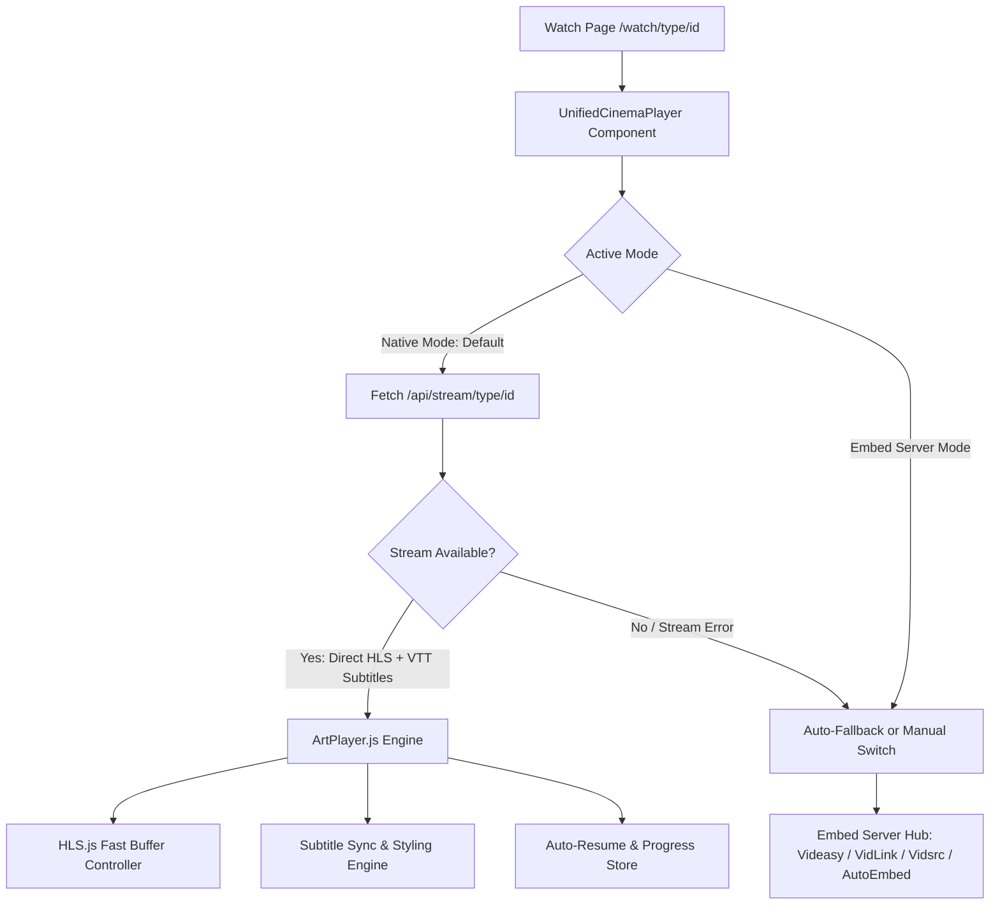

# 🎬 Design Specification: Custom ArtPlayer Cinema Streaming Engine & Subtitle Suite

- **Date:** 2026-09-05
- **Status:** Approved / In Review
- **Author:** J1 Movies Team

---

## 1. Executive Summary

J1 Movies is upgrading its video player infrastructure from standard static `<iframe>` embeds to a **Hybrid Cinema Player Engine**. The primary player will be powered by **ArtPlayer.js** with **hls.js** integration for lightning-fast HLS (`.m3u8`) playback, full visual customization matching the J1 Movies luxury dark aesthetic, and an advanced subtitle control suite (multi-language tracks, real-time subtitle sync timing adjustment, custom styling, and manual subtitle upload). If a direct stream is ever unavailable for a title, the system gracefully falls back to reliable multi-server embeds (`Videasy`, `VidLink Pro`, `Vidsrc VIP`, `AutoEmbed`).

---

## 2. Problem Statement & Goals

### Current Limitations:
- Third-party iframe embeds have variable loading speeds, inject their own controls/wrappers, and cannot be custom-styled due to cross-origin browser security.
- Subtitle customization (font sizing, color, sync delay adjustment) is impossible inside third-party iframes.
- External buffering indicators cannot be tightly coupled with the host application's UI state.

### Core Goals:
1. **Ultra-Fast Playback:** Direct `.m3u8` HLS streaming with optimized buffer settings (`hls.js`) for instant start times.
2. **100% Brand UI Consistency:** Custom luxury cinema theme (`#e50914`), custom control bars, and ambilight backglow.
3. **Full Subtitle Control:**
   - Multi-language subtitle tracks extracted from stream sources.
   - Real-time subtitle sync offset adjustment (`-5.0s` to `+5.0s` in `0.1s` steps).
   - Subtitle styling preferences (font size, color, background opacity).
   - Local `.vtt` / `.srt` file drag-and-drop or upload.
4. **Resilient Fallback:** Seamless toggle to fallback embed servers if direct HLS stream is unavailable or encountering CORS/geo-blocks.
5. **No New Paid APIs Required:** Uses existing TMDB configuration and public stream resolvers with zero subscription requirements.

---

## 3. Architecture & Data Flow



### 3.1 Backend Route: `/api/stream/[type]/[id]`
- **Method:** `GET`
- **Query Params:** `season` (optional, for TV), `episode` (optional, for TV)
- **Role:** Resolves direct `.m3u8` video streams and subtitle track URLs for a given TMDB movie or TV episode ID without exposing client keys.
- **Output Schema:**
```typescript
export interface StreamResolutionResponse {
  success: boolean;
  streamUrl?: string;
  backupStreamUrls?: string[];
  subtitles: Array<{
    url: string;
    label: string;
    language: string;
    isDefault?: boolean;
  }>;
  qualityLevels?: Array<{
    label: string;
    url: string;
  }>;
  error?: string;
}
```

---

## 4. Frontend Components & User Experience

### 4.1 `ArtPlayerCinema` Component
- **Package:** `artplayer` + `hls.js`
- **Container Styling:** Aspect-video, responsive border radii, ambilight glow halo, cinema backdrop placeholder.
- **Controls & Features:**
  - Play / Pause with center splash animation.
  - Progress bar with hover timestamp thumbnail previews.
  - Volume slider with memory and mute toggle.
  - Playback speed selector (`0.5x`, `0.75x`, `1.0x`, `1.25x`, `1.5x`, `2.0x`).
  - Picture-in-Picture (PiP) and Theater Mode (`T`) / Fullscreen (`F`).
  - Next Episode prompt for TV series when remaining time < 60s.

### 4.2 Subtitle Suite Panel
- **Language Switcher:** Popover / dropdown listing all stream-supplied subtitle tracks.
- **Timing Sync Adjustment:** Slider and `+/- 0.5s` buttons allowing viewers to adjust subtitle offset from `-5s` to `+5s`.
- **Subtitle Appearance:** Options to adjust font size (Small, Normal, Large) and background transparency.
- **Custom Subtitle Upload:** Direct file picker for user-supplied `.srt` or `.vtt` files.

### 4.3 `UnifiedCinemaPlayer` Wrapper
- Wraps both `ArtPlayerCinema` (Native Mode) and `VideasyPlayer` / Embed Hub (Embed Mode).
- Displays a clean server switcher pill bar above or below the player:
  - `⚡ Native HD (ArtPlayer)` [Selected by default]
  - `Server 1 (Videasy HD)`
  - `Server 2 (VidLink Pro)`
  - `Server 3 (Vidsrc VIP)`
  - `Server 4 (AutoEmbed)`
- If Native Mode fails to load within a timeout or returns an error, the player offers a 1-click fallback button to launch embed mode.

---

## 5. Keyboard Shortcuts & Accessibility

| Key | Action |
| :--- | :--- |
| `Space` / `K` | Play / Pause |
| `F` | Toggle Fullscreen |
| `T` | Toggle Theater Mode |
| `M` | Toggle Mute |
| `Left Arrow` / `Right Arrow` | Seek -10s / +10s |
| `Up Arrow` / `Down Arrow` | Volume +10% / -10% |
| `C` | Toggle Subtitles On / Off |
| `>` / `<` | Speed Up / Slow Down |

---

## 6. Error Handling & Resilience

1. **Network / CORS Failure on Stream:** If an HLS stream returns 403 / CORS or is geo-blocked, the player catches the error and surfaces an inline banner: *"Direct stream unavailable. Switching to fallback server..."* and automatically activates Server 1 (Videasy).
2. **Subtitle Parse Error:** If an external subtitle file fails to load, the player silently omits the track without blocking video playback.
3. **Local Storage Sync:** Continuous playback timestamp writes throttled to every 5 seconds to prevent browser lockups while ensuring watch progress is saved.

---

## 7. Implementation Deliverables

1. Install dependencies: `artplayer` and `hls.js`.
2. Create stream resolver API `/api/stream/[...path]/route.ts`.
3. Create `src/components/player/ArtPlayerCinema.tsx`.
4. Create `src/components/player/UnifiedCinemaPlayer.tsx` combining ArtPlayer with fallback servers.
5. Update `src/app/watch/[type]/[id]/page.tsx` to use the new unified cinema player.
6. Verify responsive layout, keyboard shortcuts, subtitle selection, and fallback switching.
